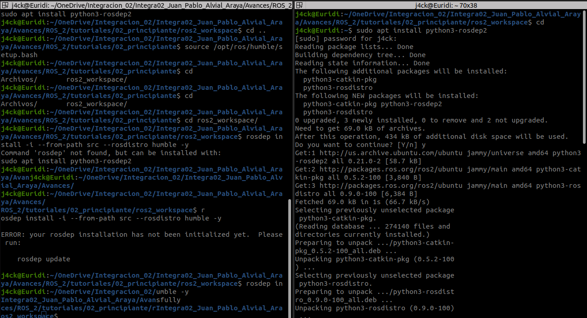
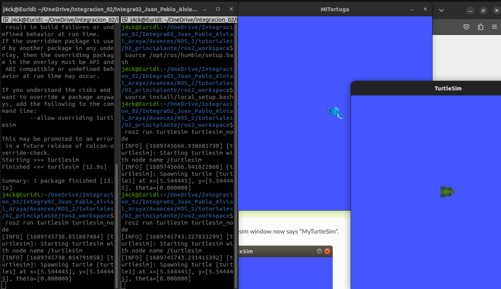

# como crear un espacio de trabajo
---
Para el espacio de trabajo se debe de iniciar ros2 para que funcionen todos los paquetes de ROS2 en la terminal. Además es posible el uso de "overlay" un segundo espacio de trabajo que no interfiere con el paquete de ros2 que es llamado "underlay".

para crear una carpeta por medio de comando se puede utilizar el comando
```
mkdir -p ros2_workspace/src
```
> mediante este comando se realiza una carpeta con el nombre ros2_workspace y una subcarpeta llamada src en el lugar que se desea, si se quiere poner en la carpeta home se puede realizar
```
mkdir -p ~/ros2_workspace/src
```

luego se debe entrar a la carpeta mediante 
```
cd ~/ros2_workspace/src
```
si se encuentra la carpeta en home. De no ser así se debe colocar el directorio.

luego se puede realizar un repositorio o utilizar uno existente como el siguiente:

```
git clone https://github.com/ros/ros_tutorials.git -b humble
```
> para esto se debe de estar en el src del espacio de trabajo

En dicho paquete se puede apreciar que todas las carpetas que no se utilizaran tienen un archivo COLCON_IGNORE con el cual no se toma en cuenta la carpeta

Como siguiente paso se debe de resolver las dependencias, para esto se debe se volver a la carpeta raiz en este caso */ros2_workspace* y realizar el siguiente código

```
rosdep install -i --from-path src --rosdistro humble -y
```

En el caso de no tener alguna dependencia se debe de instalar en home y no en el espacio de trabajo, como ejemplo se puede ver la imagen "error1"


Finalmente se debe de realizar 
```
colcon build
```

Para organizar mediante el uso de colcon, esto debe de realizarse en la raíz del espacio de trabajo. Sumado a esto se puede realizar las siguientes líneas de código.

> --packages-up-to: realiza un "build" únicamente de la carpeta necesaria
> --symlink-install: no se debe de hacer un "rebuild" con cada tweak python scripts
> --event-handlers console_direct: muestra una consola de salida mientras se realiza el "build"

Para crear un "overlay" se debe de utilizar un terminal diferente en el cual se realize lo siguiente, en la carpeta raíz del paquete.

```
source install/local_setup.bash
```

con esto si se modifica alguno de los paquetes en el overlay no debe de afectar al underlay, como se puede ver en la imagen ejemplo1


